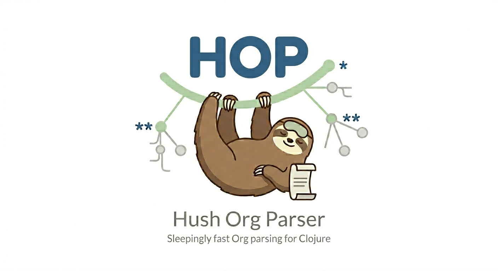

#+title: Hop - Hush Org Parser

Hush Org Parser — render and export Org files to md/html/org/json/edn/yaml/ics.

Built on [[https://github.com/bzg/organ][organ]], a Clojure Org parser.

* Usage

: hop notes.org                               # AST as JSON, contents rendered as Markdown
: hop -f html notes.org                       # Export as HTML
: hop -f md notes.org                         # Export as Markdown
: hop -f org notes.org                        # Export as Org (unwrapped)
: hop -f edn notes.org                        # AST as EDN
: hop -f yaml notes.org                       # AST as YAML
: hop -f ics notes.org                        # Export scheduled items as ICS

Render AST content in a different format:

: hop -r html notes.org                       # AST as JSON with HTML-rendered contents
: hop -r org notes.org                        # AST as JSON with Org-rendered contents

Filter:

: hop -l 2 notes.org                          # Headlines with level <= 2
: hop -L 2 notes.org                          # Same, deeper headings rendered as bold
: hop -t "TODO" notes.org                     # Title matches regex
: hop -T "Projects" notes.org                 # Ancestor title matches regex
: hop -i "section[0-9]+" notes.org            # ID or CUSTOM_ID matches regex
: hop -I "chapter\d+" notes.org               # Ancestor ID matches regex

Options:

: hop -b https://base.io -f html index.org    # Prepend base URL to relative links
: hop -c org -f html notes.org                # Use "org" Pico 2 CSS theme
: hop -c custom.css -f html notes.org         # Use a local CSS file
: hop -n notes.org                            # Preserve original line breaks
: hop -s notes.org                            # Display document statistics

Check =hop --help= for all options.

* Install

Assuming [[https://github.com/babashka/bbin][bbin]] is installed:

: bbin install io.github.bzg/hop

* Requirements

=hop= is a [[https://clojure.org][Clojure]] [[https://babashka.org][Babashka]] script.

: brew install babashka/brew/bbin

* Test

: ~$ bb test:generate
: ~$ bb test

* Feedback

Send an email to *bzg@bzg.fr*.

* Support the Clojure(script) ecosystem

If you like Clojure(script), please consider supporting maintainers by
donating to [[https://clojuriststogether.org][clojuriststogether.org]].

* License

Copyright © 2026 Bastien Guerry

Distributed under the Eclipse Public License 2.0.
